## Lab Report 1
### Logging Into and Using Your Course Specific Account on ```ieng6``` at UCSD.
---

Hello new and incoming 15L students! In this guide, you will learn the following:
- Installing VSCode
- Remotely connecting into the ```ieng6``` server at UCSD
- Basic Linux/Command Prompt Commands
- Moving files between a client & server
- Setting up an SSH Key
- Optimizing remote running

This guide will be formatted into multiple parts with explanations and screenshots of different steps. Screenshots will be included in spoilers as to not take up uncessary space. 
<details>
  <summary> » This is a spoiler, Click Me!</summary>
  This is the inside of a spoiler where images will be located!
  </details>

**On with it then!**

---

## Part 1 - Installing VSCode
1. Visit the VSCode website ([https://code.visualstudio.com/](https://code.visualstudio.com/)) and click the download button for your respective operating system. 
2. Run the installer if necessary, or if you downloaded a zip file, just unarchive that and drag VSCode to your Applications Folder.
3. Open VSCode. You should be greeted with a window that looks something like this!

<details>
  <summary> » Download Button</summary>
  
  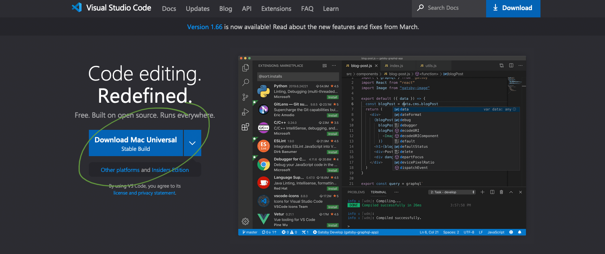
  
</details> 
<details>
  <summary> » VSCode Window</summary>
  
  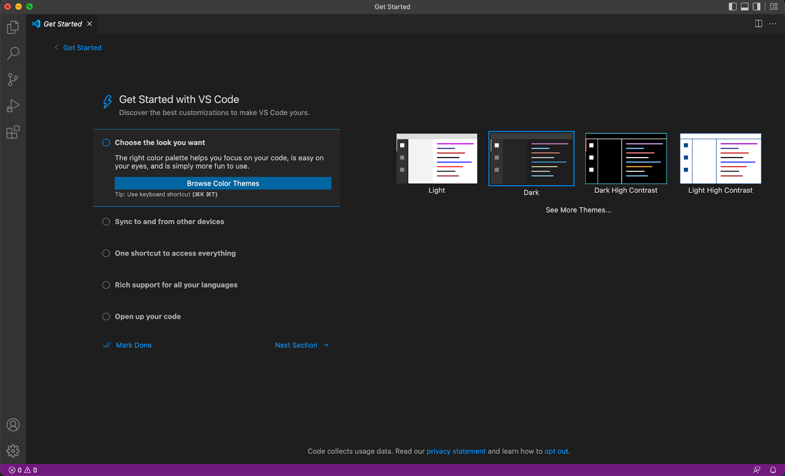
  
  </details>  

**That is all for Part 1! You now have VSCode downloaded and installed.**

## Part 2 - Remotely Connecting into the ```ieng6``` server at UCSD
To connect to the remote server named ```ieng6``` at UCSD, we will be using the SSH command.

1. At the bottom of your VSCode window, you should see a section labled *Terminal*.
2. In that terminal section, enter the command ```ssh username@ieng6.ucsd.edu```
  - ```ssh``` Is the command being run.
  - ```username``` Refers to your course-specific account username. It most likely starts with ``cs15l``. Enter your unique username here.
  - ```@ieng6.ucsd.edu``` Tells your computer where to connect to. In this case, it is the ```ieng6``` server at UCSD.
3. Once you press enter, you will be asked if you are sure that you want to continue connecting with a (yes/no) prompt. Enter ```yes``` and press enter to save the ```ieng6``` server as a known host on your computer.
4. Next, you will be asked for a password. Enter your course-specific account password here.
  - You will not see your password being entered as you type it! Do not worry, this is normal. It is a security feature.
  - Make sure you entered/pasted your password correctly, then press enter.
5. At this point, you have successfully connected to the ```ieng6``` server! You should be greeted with some welcome messages telling you the following:
  - Which specific server you are connected to.
  - How much of the CPU you are currently using.
  - Usage averages across other servers.
  - The date and time.

<details>
  <summary> » VSCode Terminal</summary>
  
  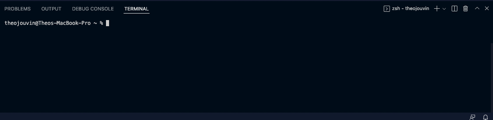
  
</details>  
<details>
  <summary> » Welcome Messages</summary>
  
  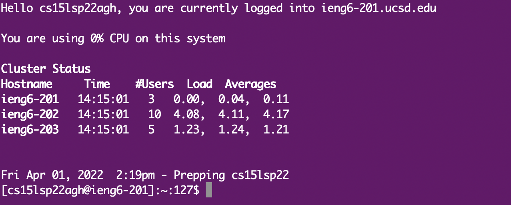
  
</details>  
  
**That is all for Part 2! You have now successfully connected to the ```ieng6``` server.**

## Part 3 - Basic Linux/Command Prompt Commands
We will now go over some basic commands that are useful to know. As you go through this guide, try these commands yourself and see if you get the same outputs!

1. ```cd <directory>``` Try "/"
  - The ```cd``` command can move you to different directories. In this case, with "/" you will be moved to the root directory of the server.
2. ```cd``` or ```cd ~```
  - Using the ```cd``` command with no arguments or with the "~" symbol will bring you to your home directory.
3. ```pwd```
  - This command will print the current working directory.
4. ```ls```
  - This command will list all of the files in your current directory.
5. ```ls -l```
  - The ```ls``` command with the "-l" argument will list all of the files in your current directory vertically, with in more detail.
6. ```ls <directory>``` Try "/"
  - The ```ls``` command with "/" or any other directory for that matter will list files in that requested directory, even if you are not in it.
7. ```cp /home/linux/ieng6/cs15lxxxx/public/README.instructor ~/```
  - The ```cp``` command will copy a file from one directory to another. Typing it as provided above (with the exception of changing "xxxx" to your current quarter and year) will copy the README.instructor file into your home directory.
8. ```cat /home/linux/ieng6/cs15lxxxx/public/README.instructor```
  - The ```cat``` command will display the contents of file. Typing it as provided above (with the exception of changing "xxxx" to your current quarter and year) will display the contents of README.instructor.

<details>
  <summary> » Command 1</summary>
  
  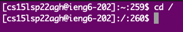
  
</details>  
<details>
  <summary> » Command 2</summary>
  
  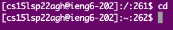
  
</details>  
<details>
  <summary> » Command 3</summary>
  
  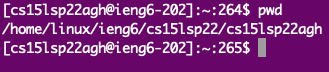
  
</details>  
<details>
  <summary> » Command 4</summary>
  
  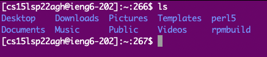
  
</details>  
<details>
  <summary> » Command 5</summary>
  
  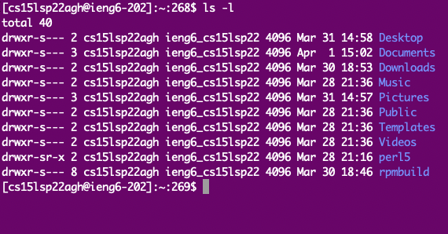
  
</details>  
<details>
  <summary> » Command 6</summary>
  
  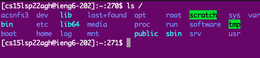
  
</details>  
<details>
  <summary> » Command 7</summary>
  
  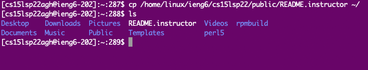
  
</details>  
<details>
  <summary> » Command 8</summary>
  
  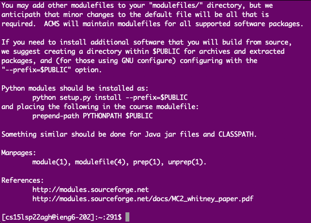
  
</details>  

**That is all for Part 3! You now know a few basic commands.**

## Part 4 - Moving Files Between a Client and a Server
In order to move files between your computer and the server, you will be using the ```scp``` command.

1. Before you learn about and run the ```scp``` command, use VSCode to create a new file on your computer.
  - Name the file ```info.java``` and save it in your user directory.
  - Paste the following into the file:
  ```
  class info {
  public static void main(String[] args) {
    System.out.println(System.getProperty("os.name"));
    System.out.println(System.getProperty("user.name"));
    System.out.println(System.getProperty("user.home"));
    System.out.println(System.getProperty("user.dir"));
  }
}
```
2. For this next step, make sure that you are disconnected from the ```ieng6``` server. You can do this by running ```logout```.
3. You are now going to transfer the file from your computer to the server using the ```scp``` command.
  - ```scp info.java username@ieng6.ucsd.edu:~/```
  - If you correctly saved the file in your user's directory on your computer, you won't need to add the path to the file in the command.
  - Again, the username portion of the command refers to your course-specific account username.
  - "~/" at the end of the command tells the server to have the file saved in your home directory.
  - Once you press enter, you will be asked to enter your password.
  - Once entered, the file will be moved to the server.

<details>
  <summary> » File Transfer</summary>
  
  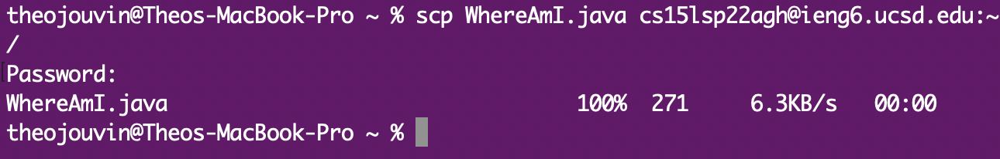
  
</details>  

**That is all for Part 4! You have now successfully moved a file between your computer and the server.**

## Part 5 - Setting Up an SSH Key
Having to enter your password every time you want to log into or transfer a file to the server can take up a lot of time. Luckily, setting up an SSH Key can speed up this process tremendously! You will no longer have to enter a password every single time, and in general, this is a more secure method of logging into a server remotely.

1. On your computer, run ```ssh-keygen```
2. You will be asked to name the file. Name it ```id_rsa``` and press enter.
3. You will be asked to enter a passphrase. Do not enter anything, just press enter.
4. A message will now tell you where your private and public key have been saved.
  - The private key ```id_rsa``` will stay on your computer.
  - The public key ```id_rsa.pub``` saved in your computer's .ssh folder will be transferred to the server. This will be done using the ```scp``` command that was reviewed earlier!
5. You will now need to log into the server to create a .ssh directory there.
6. Once logged in, run ```mkdir .ssh```
  - This command makes a directory, named .ssh.
7. Log out of the server.
8. Once on your computer again, run the command ```scp ~/.ssh/id_rsa.pub username@ieng6.ucsd.edu:~/.ssh/authorized_keys```
  - This is the last time that you will need to enter your password!
  - This will transfer the public key into a file "authorized_keys" in the ".ssh" directory you created in a previous step.
9. Try logging into the server again now. Notice that you will be automatically logged in without the need to enter your password.

<details>
  <summary> » Logged In With No Password</summary>
  
  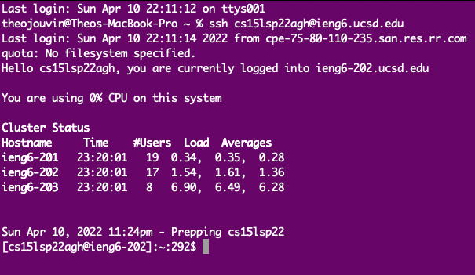
  
</details> 

**That is all for Part 5! You have now successfully set up an SSH Key.**

## Part 6 - Optimizing Remote Running
Creating the SSH Keys in the last step was only the first step in optimizing remote running. Not having to enter a password everytime you want to move a file or run a command remotely saves a lot of time. However, even more time can be saved by running multiple commands to the server all in one line.

1. Remember the Java file you transferred to the server earlier? You can tell the server to compile and run that file, giving you its output all in one line.
2. Try running the command ```ssh username@ieng6.ucsd.edu "javac info.java; java info.java"```
  - This command will connect your computer to the remote server and tell it to first, compile the "info.java" file, then run it.
  - Because the commands in the second half of the line are in quotes, they will all be run on the server.
  - Including a semi-colon after the individual commands tells the server to run all of them.
3. Let's say you made an edit to the file on your computer and needed to re-transfer it, re-compile it, and re-run it. This can easily be done by using the up-arrow on your keyboard to go through previously ran commands.
  - First, re-running the ```scp``` command.
  - Then, re-running the one-linher with multiple commands.
  - All of this done with only a few keystrokes, and without the need for a password to be entered on every run.

<details>
  <summary> » Multiple Commands</summary>
  
  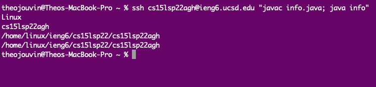
  
</details> 

**That is all for Part 6! You have now optimized your remote running.**

---

#### Thank you for reading this guide / lab report!
