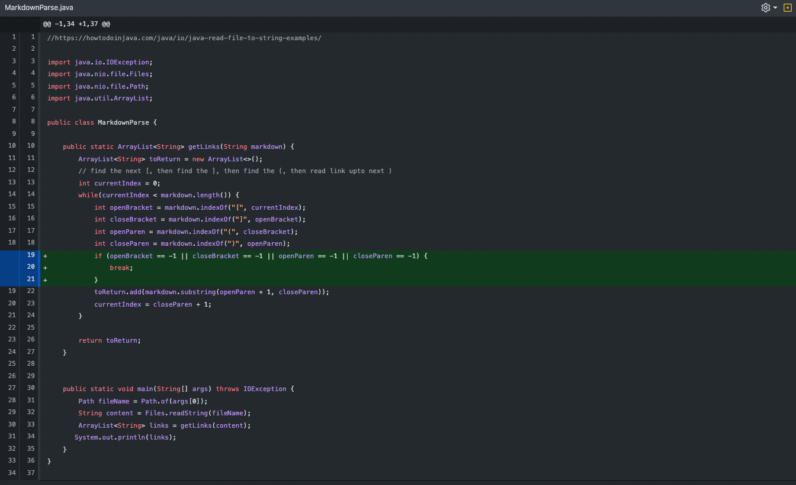
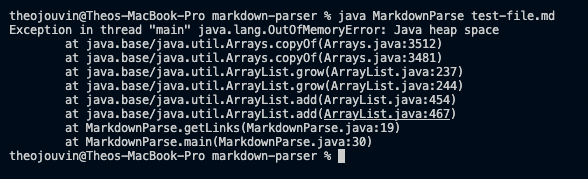
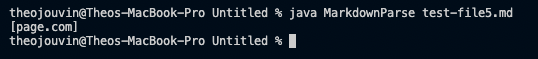
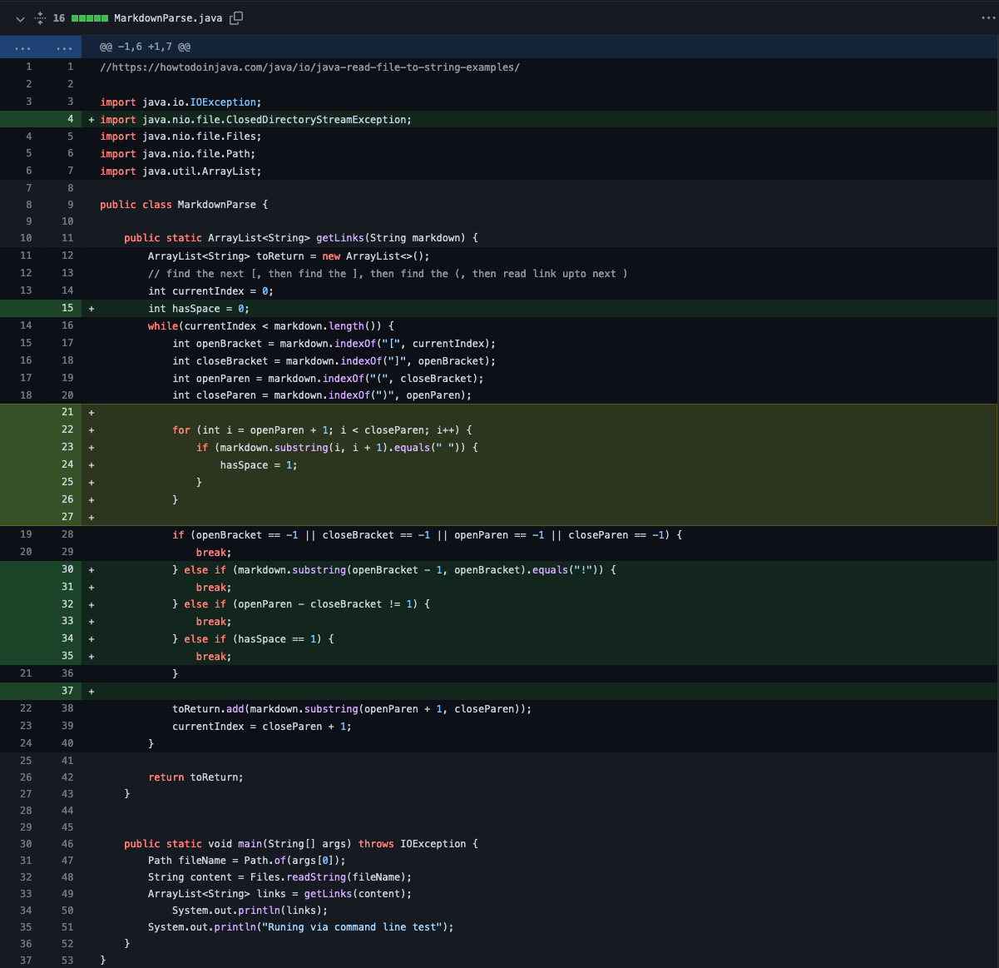
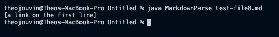

## Lab Report 3
### SSH Config, GitHub Access, and Copying Whole Directories
---

This lab report contains the following;
- An example of an SSH Configuration file making it easier to connect to and transfer files to an external server.
- An example of setting up access to GitHub from an external server to allow for remote edits and commits.
- An example of copying a whole directory to an external server and running tests with those files.

Screenshots / GIFs will be included in spoilers as to not take up uncessary space. 

<details>
  <summary> » This is a spoiler, Click Me!</summary>
  This is the inside of a spoiler where images will be located!
  </details>

---

## 1. Streamlining SSH Configuration

  When running a test file with an extra line at the bottom, the MarkdownParse program will loop infinitely. In this case, the failure inducing input is that of a lack of opening and closing brackets/parentheses after a previously found link if the file contains more text. The symptom is clear, the pogram will loop infinitely, causing Java to run out of memory. This occurs because MarkdownParse continues to loop, searching for the next set of brackets/parentheses and does nothing except try again if nothing is found. The fix adds a case to MarkdownParse telling the program to break out of the loop if a new link is not found.
  
<details>
  <summary> » Code Change Difference</summary>
  
  </details>

<details>
  <summary> » Symptom of Failure Inducing Input</summary>
  
  </details>


## 2. Setting up GitHub Access from ```ieng6```

  When running a test file with a link in parantheses, even if the parentheses are not in the correct URL format (i.e. next to a closing bracket), MarkdownParse will still return the link. In this case, the failure inducing input is that of a link in a set of parentheses in an incorrect URL format. The symptom is clear, the pogram will output the link, when the intended output should show that no link was found. This occurs because this iteration of MarkdownParse only searched for a set of parentheses containing a link without regard to the proper URL format. The fix adds a case to MarkdownParse telling the program to return no link if the pair of parentheses are not next to a set of brackets in the proper format.
  
<details>
  <summary> » Code Change Difference</summary>
  
  </details>

<details>
  <summary> » Symptom of Failure Inducing Input</summary>
  
  </details>
  
  
## 3. Copying Whole Directories With ```scp -r```

  When running a test file with text in parantheses, even if the text is not a link, MarkdownParse will still return that text. In this case, the failure inducing input is that of any text in a set of parentheses. The symptom is clear, the pogram will output the text, when the intended output should show that no link was found. This occurs because this iteration of MarkdownParse returned anything that was found in a set of parentheses. The fix adds a case to MarkdownParse telling the program to return no link if the pair of parentheses contains text with spaces. (This is how GitHub handles URLS in Markdown. The URL does not need to contain other URL elements like a protocol or TLD.)
  
<details>
  <summary> » Code Change Difference</summary>
  
  </details>

<details>
  <summary> » Symptom of Failure Inducing Input</summary>
  
  </details>


**This line was added from the ```ieng6``` server!```**
