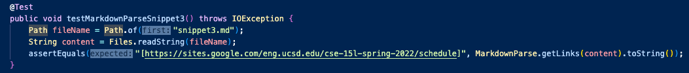
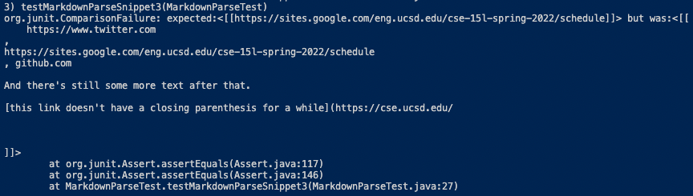

## Lab Report 4
### Testing the Implementation of Two Versions of MarkdownParse
---

This lab report contains the following:
- A link to my lab group's Markdown Parser repository.
- A link to another lab group's Markdown Parser repository that my group reviewed.
- For three Markdown code snippets:
  - Expected Output
  - MarkdownParseTest Code
  - Actual outputs for both implementations of MarkdownParse.
  - Test results for both implementations of MarkdownParse.
  - Potential code fixes to achieve expected output, if necessary.

Screenshots will be included in spoilers as to not take up uncessary space. 

<details>
  <summary> » This is a spoiler, Click Me!</summary>
  This is the inside of a spoiler where images will be located!
  </details>

---

- My lab group's Markdown Parser repository: <a href="https://github.com/Mashyuf/markdown-parser" target="_blank">Mashyuf/markdown-parser</a>
- The reviewed Markdown Parser repository: <a href="https://github.com/cmy0357/markdown-parser" target="_blank">cmy0357/markdown-parser</a>

---

## Snippet 1

[Markdown Snippet](lab4resources/files/snippet1)

  Using SSH Keys instead of a password made connecting to the remote server easier. Adding the host to the ```/.ssh/config``` file makes the process of remote connecting even faster. I added a few lines shown in the first image into the config file using TextEdit. Then, in the second image, I demonstrated logging in with the ```ssh``` command using the nickname that I gave the host in the config file. Finally, in the last image, I demonstrated copying a file over to the remote server using the ```scp``` command. This was all much faster and easier!
  
<details>
  <summary> » Expected Output</summary>
  [`google.com, google.com, ucsd.edu]
  <br />
  </details>

<details>
  <summary> » Test Code</summary>
  
  </details>

<details>
  <summary> » Our Actual Output</summary>
  
  </details>
  
<details>
  <summary> » Our Failed Test</summary>
  
  </details>
  
<details>
  <summary> » Their Actual Output</summary>
  
  </details>
  
<details>
  <summary> » Their Failed Test</summary>
  
  </details>


## Snippet 2

[Markdown Snippet](lab4resources/files/snippet2)

  Cloning a GitHub Repository to the remote server using its link only allows limited access to the repository. (Ex. Checking the status and pulling updates). If we want to commit and push changes, further authentication needs to be set-up. I went through this process, and created SSH keys to do so. Shown in the first spoiler are the locations of the public key (```~/.ssh```) on the remote server and on GitHub. Shown in the second spoiler is the location of the private key on the remote server (also in the ```~/.ssh``` folder). In the third spoiler, I staged, committed, and pushed a change to GitHub. Lastly, the fourth spoiler and accompanying link shows the commit.
  
<details>
  <summary> » Expected Output</summary>
  [a.com, a.com(()), example.com]
  <br />
  </details>

<details>
  <summary> » Test Code</summary>
  
  </details>
  
<details>
  <summary> » Our Actual Output</summary>
  
  </details>
  
<details>
  <summary> » Our Failed Test</summary>
  
  </details>
  
<details>
  <summary> » Their Actual Output</summary>
  
  </details>
  
<details>
  <summary> » Their Failed Test</summary>
  
  </details>
  
  
## Snippet 3

[Markdown Snippet](lab4resources/files/snippet3)

  Copying an entire folder to a remote server is as easy as adding the ```-r``` flag to the ```scp``` command. In the first image, I demonstrate copying the entirety of the MarkdownParse folder. In the second image, I compiled and ran tests on the remote server in the directory that I had just copied over. In the last image, I demonstrated copying a directory, compiling, and running tests, all in one command using quotes and semi-colons.
  
<details>
  <summary> » Expected Output</summary>
  [https://sites.google.com/eng.ucsd.edu/cse-15l-spring-2022/schedule]
  <br />
  </details>

<details>
  <summary> » Test Code</summary>
  
  </details>

<details>
  <summary> » Our Actual Output</summary>
  
  </details>
  
<details>
  <summary> » Our Failed Test</summary>
  
  </details>
  
<details>
  <summary> » Their Actual Output</summary>
  
  </details>
  
<details>
  <summary> » Their Failed Test</summary>
  
  </details>
