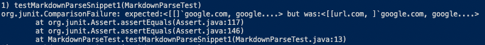

## Lab Report 4
### Testing the Implementation of Two Versions of MarkdownParse
---

This lab report contains the following:
- A link to my lab group's Markdown Parser repository.
- A link to another lab group's Markdown Parser repository that my group reviewed.
- For three Markdown code snippets:
  - Expected Output
  - MarkdownParseTest Code
  - Actual outputs for both implementations of MarkdownParse.
  - Test results for both implementations of MarkdownParse.
  - Potential code fixes to achieve expected output, if necessary.

Screenshots will be included in spoilers as to not take up uncessary space. 

  
 » This is a spoiler, Click Me!

  This is the inside of a spoiler where images will be located!
  

---

- My lab group's Markdown Parser repository: <a href="https://github.com/Mashyuf/markdown-parser" target="_blank">Mashyuf/markdown-parser</a>
- The reviewed Markdown Parser repository: <a href="https://github.com/cmy0357/markdown-parser" target="_blank">cmy0357/markdown-parser</a>

---

## Snippet 1

[Markdown Snippet](lab4resources/files/snippet1)

  For this snippet, both MarkdownParse implementations failed their tests.
  

  
 » Expected Output

  [`google.com, google.com, ucsd.edu]
   
  

  
 » Test Code

  
  

  
 » Our Actual Output

  
  

  

  
 » Our Failed Test

  
  

  

  
 » Their Actual Output

  
  

  

  
 » Their Failed Test

  
  

## Snippet 2

[Markdown Snippet](lab4resources/files/snippet2)

  For this snippet, both MarkdownParse implementations failed their tests.
  

  
 » Expected Output

  [a.com, a.com(()), example.com]
   
  

  
 » Test Code

  
  

  

  
 » Our Actual Output

  
  

  

  
 » Our Failed Test

  
  

  

  
 » Their Actual Output

  
  

  

  
 » Their Failed Test

  
  

  
  
## Snippet 3

[Markdown Snippet](lab4resources/files/snippet3)

  For this snippet, both MarkdownParse implementations failed their tests.
  

  
 » Expected Output

  [https://sites.google.com/eng.ucsd.edu/cse-15l-spring-2022/schedule]
   
  

  
 » Test Code

  
  

  
 » Our Actual Output

  
  

  

  
 » Our Failed Test

  
  

  

  
 » Their Actual Output

  
  

  

  
 » Their Failed Test

  
  

