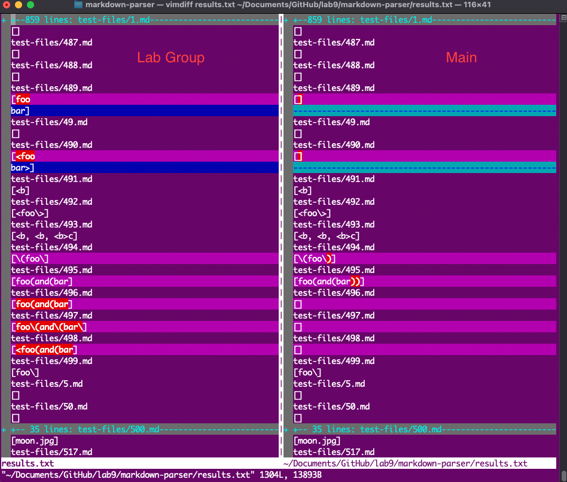
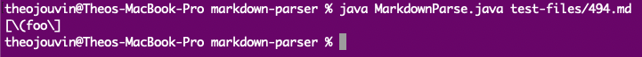
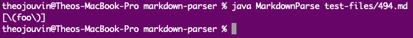
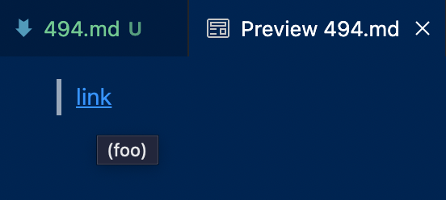
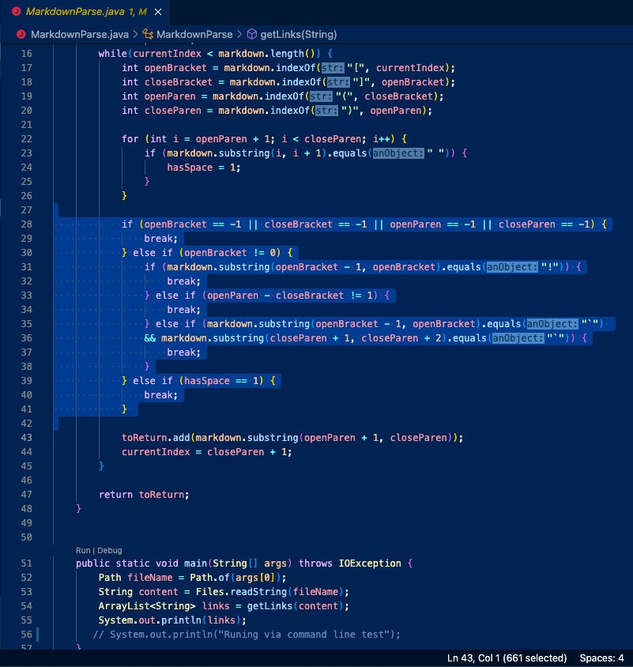
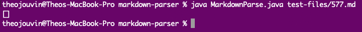
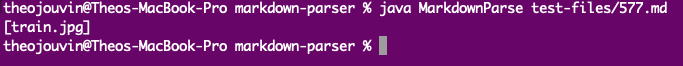
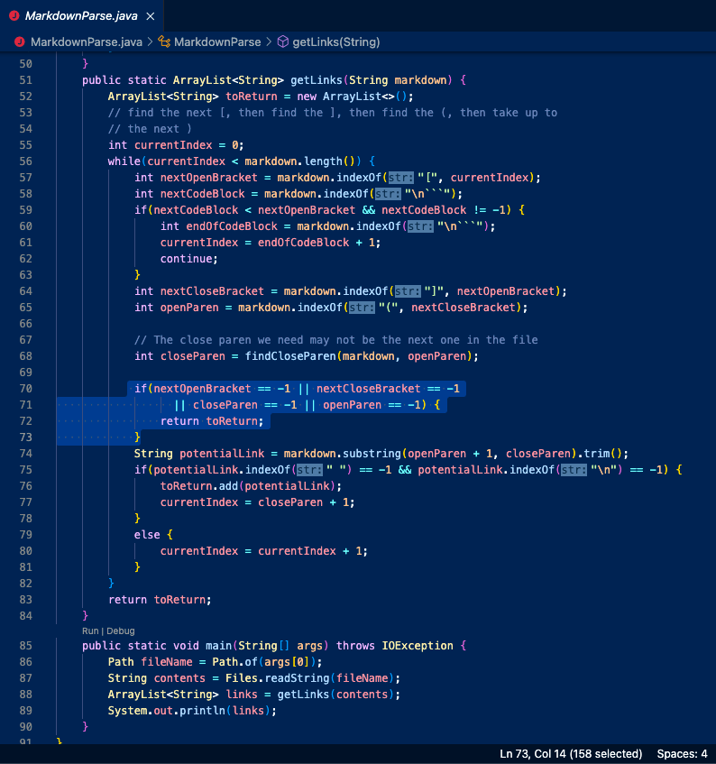

## Lab Report 5
### Testing Two Implementations of MarkdownParse Using ```vimdiff``` With Many Test Files
---

This lab report contains the following:
- An explanation on how the different test results were found between both implementations of MarkdownParse.
- Links to two test files with different results between both implementations of MarkdownParse.
- For each test:
  - A description of which implentation of MarkdownParse is correct (or incorrect, if both are) with its output.
  - Actual outputs from both implementations of MarkdownParse.
  - Expected outputs from both implementations of MarkdownParse.
  - For the (or for one) implementation that is incorrect:
    - A short description of the bug found in the code that is causing the incorrect output.
    - The location in the code where a change should be made that can correct the output.

Screenshots will be included in spoilers as to not take up uncessary space. 

<details>
  <summary> » This is a spoiler, Click Me!</summary>
  This is the inside of a spoiler where images will be located!
  </details>

---

To find the differences between the test results, I first used a script to run through all of the test files and output their results into a text file. I did this for both my lab group's implementation of MarkdownParse as well as the main implementation of MarkdownParse given to the class. Next, I compared both text files and their results using the ```vimdiff``` command. Using this visual representation of the differences, I was able to select the two that I wanted to cover in this lab report; they are linked below.

<details>
  <summary> » vimdiff</summary>
  <br />
  </details>

- Test File 494: <a href="https://github.com/nidhidhamnani/markdown-parser/blob/main/test-files/494.md?plain=1" target="_blank">494.md</a>
- Test File 577: <a href="https://github.com/nidhidhamnani/markdown-parser/blob/main/test-files/577.md?plain=1" target="_blank">577.md</a>

---

## Test File 494

  For this snippet, both MarkdownParse implementations failed their tests. Both implementations included ```url.com``` when they should not have. I feel like this code change would be pretty small, less than 10 lines. The link should not have been included because since the backtick came first, it should parse as a code block. Of course, both implementations of MarkdownParse did not know this. The fix could be to check for a pair of backticks, with the first backtick occuring before the start of the URL syntax (before the opening bracket). My group's implementation of MarkdownParse also did not output ```ucsd.edu```, probably because of the closing bracket in the link title portion of the URL syntax. A fix for this could include skipping over brackets in the title portion if they do not complete a valid URL.
  
<details>
  <summary> » Lab Group's Actual Output</summary>
  
  </details>

<details>
  <summary> » Main MarkdownParse's Actual Output</summary>
  
  </details>

<details>
  <summary> » Expected Output</summary>
  [(foo)]
  <br />
  </details>
  
<details>
  <summary> » Change Location in Code</summary>
  
  </details>


## Test File 577

  For this snippet, both MarkdownParse implementations failed their tests. Both implementations outputted ```a.com((``` instead of ```a.com(())```. I feel like this code change may be longer than 10 lines. It looks like both implementations completed the URL early, because of the extra parentheses. A potential fix for this could be to have MarkdownParse count its current position in the parentheses to ensure that it returns the link once the syntax has actually completed. My group's implementation of MarkdownParse also did not output ```example.com```, probably because of the extra brackets. The fix for this could be similar to that of the previous failure's solution; having the program count its current position in the brackets to ensure that it actually returns a link when one is present.
  
<details>
  <summary> » Lab Group's Actual Output</summary>
  
  </details>

<details>
  <summary> » Main MarkdownParse's Actual Output</summary>
  
  </details>

<details>
  <summary> » Expected Output</summary>
  [(foo)]
  <br />
  </details>
  
<details>
  <summary> » Change Location in Code</summary>
  
  </details>
  
